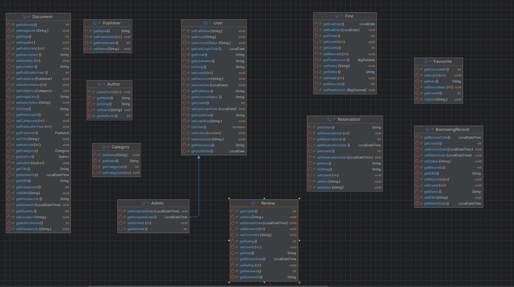
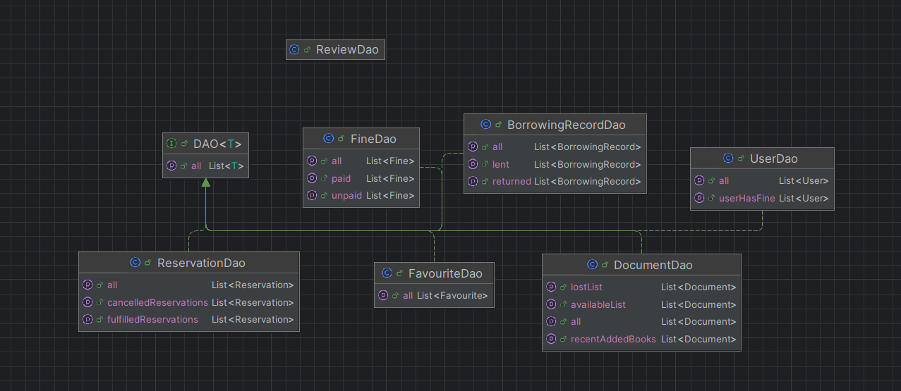
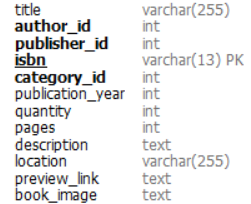
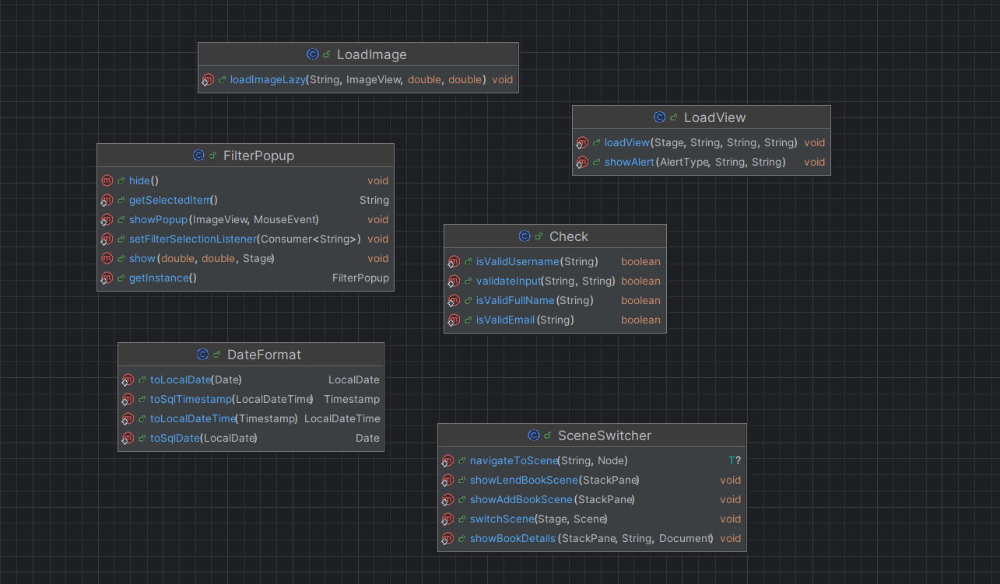

# Destroy_Library_Management

## Mục Lục
1. [Bản thiết kế các lớp của dự án](#bản-thiết-kế-các-lớp-của-dự-án)
2. [Bảng đóng góp của thành viên](#bảng-đóng-góp-của-thành-viên)
3. [Dependencies để chạy dự án](#dependencies-để-chạy-dự-án)

---

### 1. Bản thiết kế của dự án
Dự án được thiết kế để đảm bảo khả năng mở rộng và dễ bảo trì.  
Dưới đây là danh sách các package của dự án:

#### **Model**

- **Document**: Đại diện cho một cuốn sách trong thư viện.
- **User**: Đại diện cho người dùng.
- **Reservation**: Đại diện cho yêu cầu đặt trước sách.  
- **Admin**: Đại diện cho người quản lý người dùng.
- **Favourite**: Đại diện cho sách yêu thích của người dùng.
- **Fine**: Đại diện cho bản ghi phạt.
- **Publisher**: Đại diện cho nhà xuất bản của cuốn sách.
- **Author**: Đại dện cho tác giả cuốn sách.
- **Category**: Đại diện cho thể loại của sách.
- **BorrowingRecord**: Đại diện cho bản ghi mượn sách.
- **Review**: Nội dung sẽ được phát triển trong tương lai gần.
#### **Dao**: 
- Gồm các lớp để tương tác với cơ sở dữ liệu nhằm lấy dữ liệu tương ứng của các đối tượng trong model.

#### **Controller**
- Gồm các controller quản lý giao diện ứng dụng, có tích hợp đa luồng để cải thiện trải nghiệm người dùng.
   
#### **API**
- Thực hiện request get để lấy được các thông tin cần thiết của sách: 

#### **Config**
- Gồm các lớp thực hiện việc kết nối với database và điểm gọi API.
#### **Utils**
- Gồm các lớp tiện ích sử dụng xuyên suốt chương trình.

---
### 2. Bảng đóng góp của thành viên
| Thành viên         | Công việc chính                                                                                                                                                                                                                  |
|--------------------|----------------------------------------------------------------------------------------------------------------------------------------------------------------------------------------------------------------------------------|
| Nguyễn Thùy Linh   | - Thiết kế cấu trúc cơ sở dữ liệu - Tham gia xây dựng controller của giao diện admin -Thiết kế giao diện login, signup -Tham gia xây dựng các lớp DAO  - Tham gia xây dựng utils                                 |
| Trần Hoàng Mai Anh | - Xây dựng controller của giao diện admin và user -Thiết kế giao diện admin, user -Tham gia xây dựng các lớp DAO - Xây dựng các lớp trong model đại diện cho đối tượng trong ứng dụng  - Tham gia xây dựng utils |
| Lê Huyền Linh      | - Thiết kế giao diện user - Tham gia xây dựng controller cho giao diện user                                                                                                                                                  |

---
