# Destroy_Library_Management

## Mục Lục
1. [Bản thiết kế các lớp của dự án](#bản-thiết-kế-các-lớp-của-dự-án)
2. [Bảng đóng góp của thành viên](#bảng-đóng-góp-của-thành-viên)
3. [Dependencies để chạy dự án](#dependencies-để-chạy-dự-án)
4. [Demo dự án](#demo-dự-án)

---

### 1. Bản thiết kế của dự án
Dự án được thiết kế để đảm bảo khả năng mở rộng và dễ bảo trì.  
Dưới đây là danh sách các package của dự án:

#### **Model**
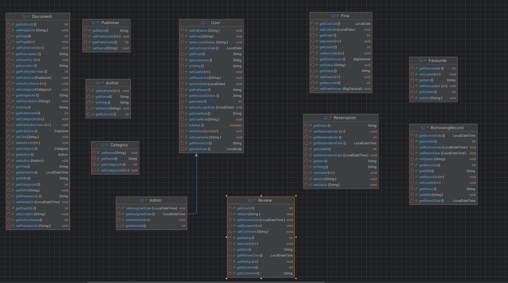
- **Document**: Đại diện cho một cuốn sách trong thư viện.
- **User**: Đại diện cho người dùng.
- **Reservation**: Đại diện cho yêu cầu đặt trước sách.
- **Admin**: Đại diện cho người quản lý người dùng.
- **Favourite**: Đại diện cho sách yêu thích của người dùng.
- **Fine**: Đại diện cho bản ghi phạt.
- **Publisher**: Đại diện cho nhà xuất bản của cuốn sách.
- **Author**: Đại dện cho tác giả cuốn sách.
- **Category**: Đại diện cho thể loại của sách.
- **BorrowingRecord**: Đại diện cho bản ghi mượn sách.
- **Review**: Nội dung sẽ được phát triển trong tương lai gần.

#### **Database**
 
  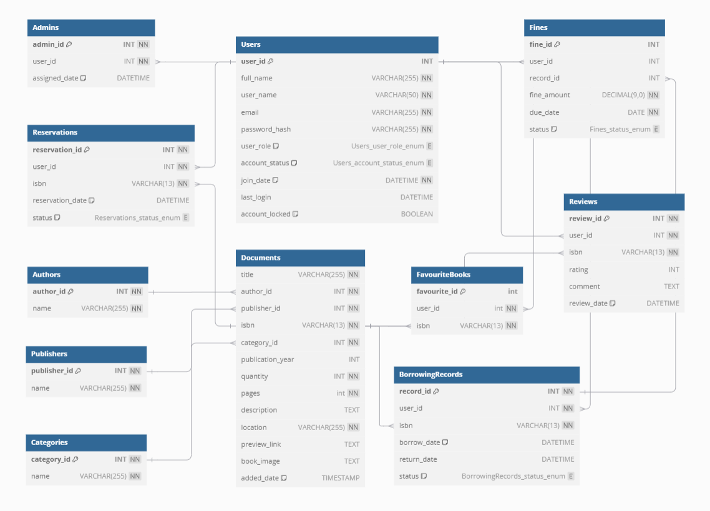

#### **Dao**:
- Gồm các lớp để tương tác với cơ sở dữ liệu nhằm lấy dữ liệu tương ứng của các đối tượng trong model.
  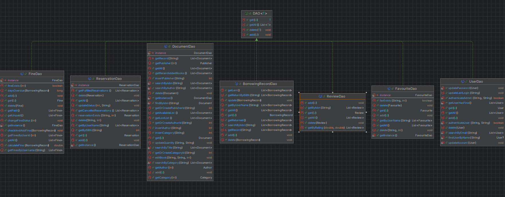
#### **Controller**
- Gồm các controller quản lý giao diện ứng dụng, có tích hợp đa luồng để cải thiện trải nghiệm người dùng.

#### **API**
- Thực hiện request get để lấy được các thông tin cần thiết của sách:

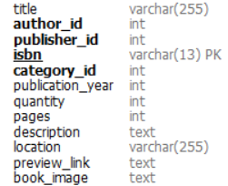

#### **Config**
- Gồm các lớp thực hiện việc kết nối với database và điểm gọi API.
#### **Utils**
- Gồm các lớp tiện ích sử dụng xuyên suốt chương trình.
  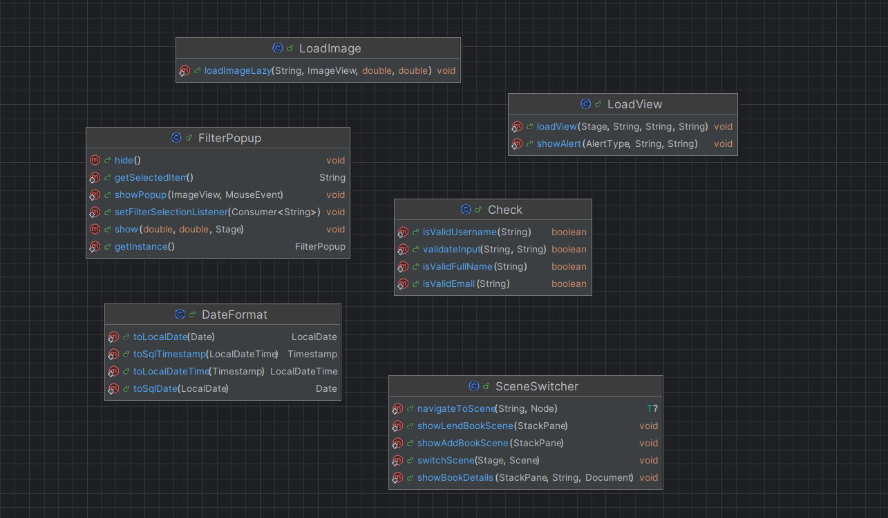
---
### 2. Bảng đóng góp của thành viên
| Thành viên         | Công việc chính                                                                                                                                                                                                                                                                                          |
|--------------------|----------------------------------------------------------------------------------------------------------------------------------------------------------------------------------------------------------------------------------------------------------------------------------------------------------|
| Nguyễn Thùy Linh   | - Thiết kế cấu trúc cơ sở dữ liệu<br/>- Tham gia xây dựng controller của giao diện admin<br/>-Thiết kế giao diện login, signup<br/>-Tham gia xây dựng các lớp DAO <br/>- Tham gia xây dựng utils                                                                                                         |
| Trần Hoàng Mai Anh | - Xây dựng controller tích hợp đa luồng của giao diện admin và user<br/>-Thiết kế giao diện admin, user(có sự sáng tạo)<br/>-Tham gia xây dựng các lớp DAO<br/>- Xây dựng các lớp trong model đại diện cho đối tượng trong ứng dụng <br/>- Tham gia xây dựng utils<br/>- Tham gia xây dựng cơ sở dữ liệu |
| Lê Huyền Linh      | - Thiết kế giao diện user<br/>- Tham gia xây dựng controller cho giao diện user<br/>- Sáng tạo tính năng người dùng: Yêu thích + preview on screen tăng trải nghiệm người dùng và tính năng recommend sách dựa trên lượt requests<br/>- Thêm thao tác log out ở giao diện admin.                         |

---


### 3. Dependencies để chạy dự án
Dự án sử dụng *Gradle* để quản lý các thư viện.  
Dưới đây là các dependencies chính:

- *JavaFX*: Dùng để xây dựng giao diện người dùng.
- *MySQL Connector/J*: Để kết nối với cơ sở dữ liệu MySQL.
- *Google Books API*: Hỗ trợ tìm kiếm thông tin sách.
- *Gson*: Dùng để xử lý JSON (chuyển đổi dữ liệu).
- *Junit 5*: Dùng để kiểm thử ứng dụng.

#### Cách cài đặt dependencies
1. Đảm bảo bạn đã cài đặt *Java 17* trở lên.
2. Chạy lệnh sau để tải tất cả dependencies:

   ./gradlew build

3. Khởi chạy ứng dụng bằng lệnh:

   ./gradlew run

4. Cài đặt Configurations:

   **Mở Run/Debug Configurations**:
    - Trong IntelliJ IDEA, vào **Run > Edit Configurations...**.
    - Chọn cấu hình dự án bạn đang sử dụng (hoặc tạo một cấu hình mới nếu chưa có).

   **Thêm VM options**:
    - Trong phần **VM options**, thêm các dòng sau vào: (nếu sử dụng javafx 22.0.2)

      ```bash
      --module-path "D:\javafx-sdk-22.0.2\lib" 
      --add-modules javafx.controls,javafx.fxml 
      --add-modules=javafx.swing,javafx.graphics,javafx.fxml,javafx.media,javafx.web 
      --add-reads javafx.graphics=ALL-UNNAMED 
      --add-opens javafx.controls/com.sun.javafx.charts=ALL-UNNAMED 
      --add-opens javafx.graphics/com.sun.javafx.iio=ALL-UNNAMED 
      --add-opens javafx.graphics/com.sun.javafx.iio.common=ALL-UNNAMED 
      --add-opens javafx.graphics/com.sun.javafx.css=ALL-UNNAMED 
      --add-opens javafx.base/com.sun.javafx.runtime=ALL-UNNAMED
      ```

---

### 4. Demo dự án

## User Home Screen:
- Hiển thị My Book Shelf, Recommendations và Newly Arrivals, gợi ý cho người dùng chọn

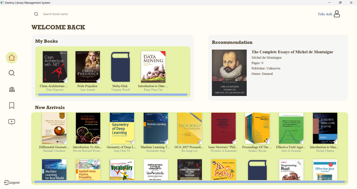

## Favorites + Borrow Books:
- Lưu sách vào yêu thích & mượn sách

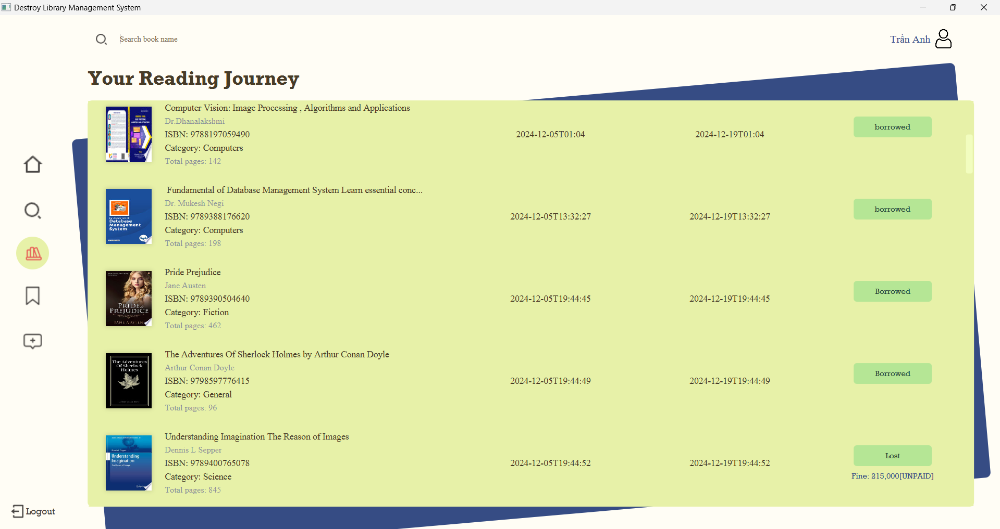

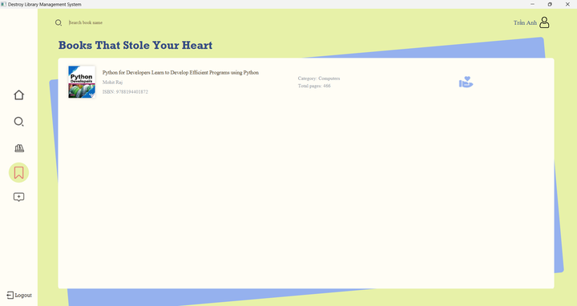


## Admin Dashboard
- Bao gồm chức năng cao nhất là quản lý thông tin: Sách & Người dùng

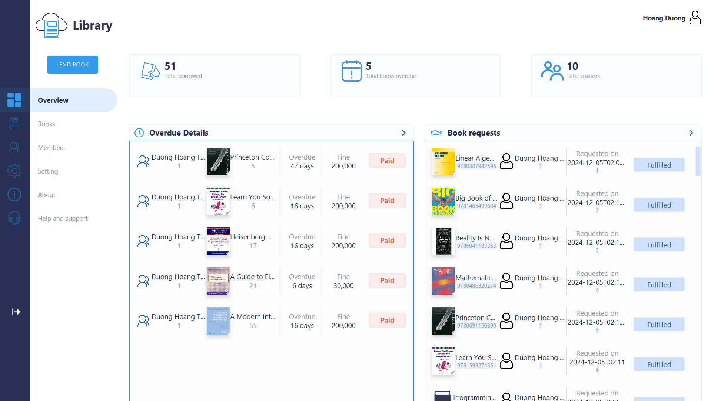

## Book Management
- Quản lý thông tin sách nhập vào từ API

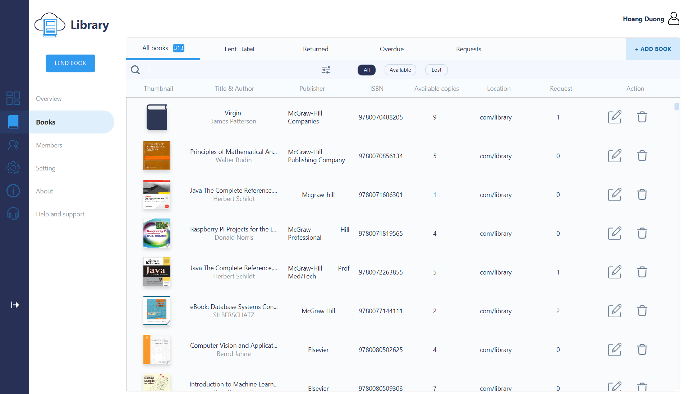

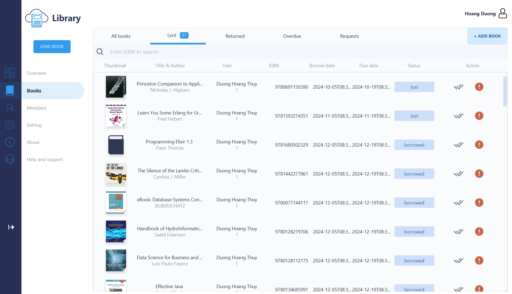

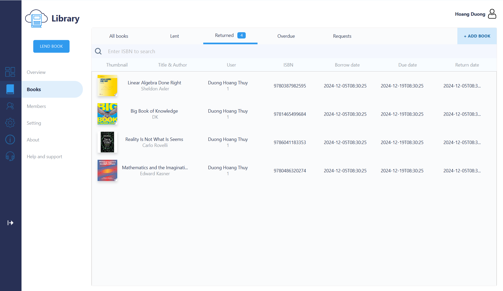

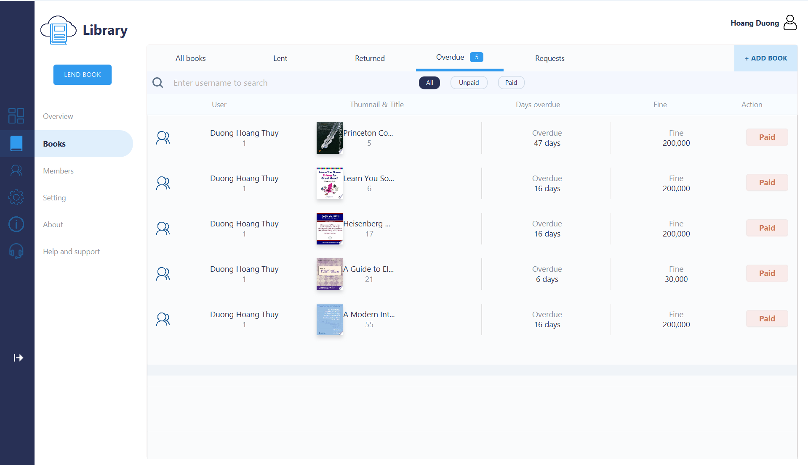

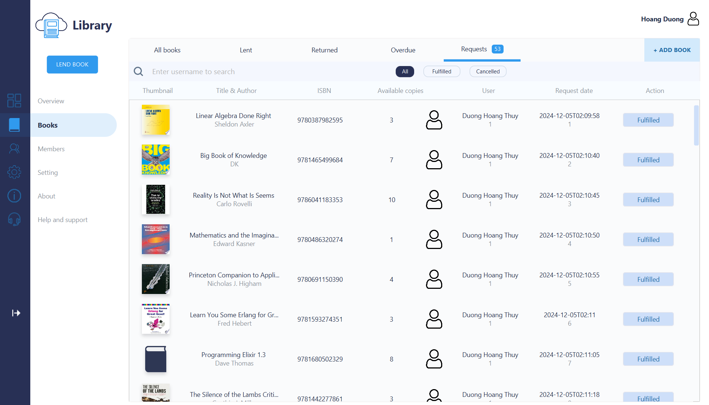

   


