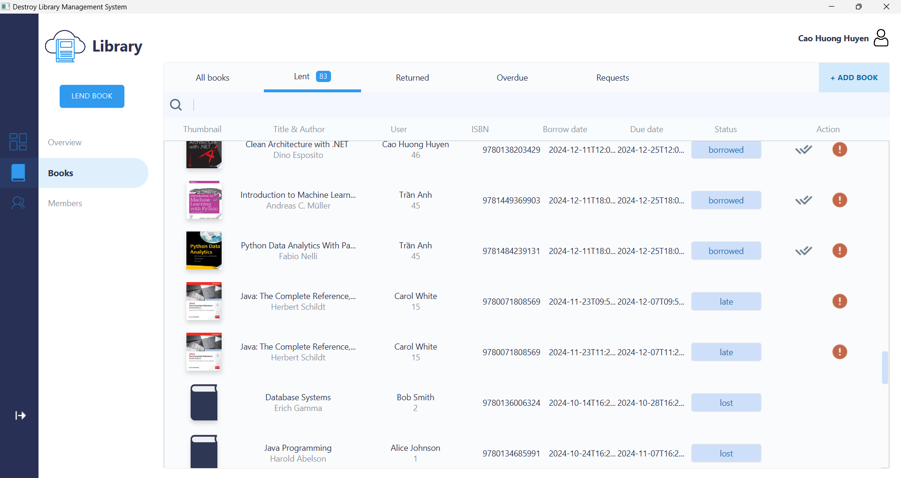

# Destroy_Library_Management

## Mục Lục
1. [Bản thiết kế các lớp của dự án](#bản-thiết-kế-các-lớp-của-dự-án)
2. [Bảng đóng góp của thành viên](#bảng-đóng-góp-của-thành-viên)
3. [Dependencies để chạy dự án](#dependencies-để-chạy-dự-án)
4. [Demo dự án](#demo-dự-án)

---

### 1. Bản thiết kế của dự án
Dự án được thiết kế để đảm bảo khả năng mở rộng và dễ bảo trì.  
Dưới đây là danh sách các package của dự án:

#### **Model**

- **Document**: Đại diện cho một cuốn sách trong thư viện.
- **User**: Đại diện cho người dùng.
- **Reservation**: Đại diện cho yêu cầu đặt trước sách.
- **Admin**: Đại diện cho người quản lý người dùng.
- **Favourite**: Đại diện cho sách yêu thích của người dùng.
- **Fine**: Đại diện cho bản ghi phạt.
- **Publisher**: Đại diện cho nhà xuất bản của cuốn sách.
- **Author**: Đại dện cho tác giả cuốn sách.
- **Category**: Đại diện cho thể loại của sách.
- **BorrowingRecord**: Đại diện cho bản ghi mượn sách.
- **Review**: Đại diện cho cảm nghĩ của người đọc về cuốn sách.

#### **Database**
 
  

#### **Dao**:
- Gồm các lớp để tương tác với cơ sở dữ liệu nhằm lấy dữ liệu tương ứng của các đối tượng trong model.
  
#### **Controller**
- Gồm các controller quản lý giao diện ứng dụng, thể hiện được workflow của hai loại người dùng: readers và admins.
- Có tích hợp đa luồng, design pattern để cải thiện trải nghiệm người dùng và hiển thị dữ liệu theo thời gian thực.
- Dự đoán ngoại lệ và thông báo bằng việc hiển thị Alert.

#### **API**
- Thực hiện request get để lấy được các thông tin cần thiết của sách và insert vào database của ứng dụng:


#### **Config**
- Gồm các lớp thực hiện việc kết nối với database và điểm gọi API.
#### **Utils**
Gồm các lớp tiện ích sử dụng xuyên suốt chương trình
+ Check: đảm bảo tính đúng đắn của định dạng dữ liệu vào khi người dùng đăng nhập và đăng ký tài khoản.
+ DateFormat: chuyển kiểu dữ liệu ngày giờ để insert vào database.
+ FilterPopup: hiển thị tiêu chí tìm kiếm.
+ LoadImage: tích hợp đa luồng để hiển thị ảnh, tránh việc giao diện bị treo.
+ LoadView: hiển thị các cửa sổ giao diện.
+ SceneSwitcher: chuyển đổi giữa các cửa sổ giao diện một cách mượt mà.

  
---
### 2. Bảng đóng góp của thành viên
| Thành viên         | Công việc chính                                                                                                                                                                                                                                                                                                                                                                                                     |
|--------------------|---------------------------------------------------------------------------------------------------------------------------------------------------------------------------------------------------------------------------------------------------------------------------------------------------------------------------------------------------------------------------------------------------------------------|
| Nguyễn Thùy Linh   | - Thiết kế cấu trúc cơ sở dữ liệu<br/>- Tham gia xây dựng tính năng trong giao diện admin<br/>- Thiết kế giao diện login, signup và user<br/>- Tham gia xây dựng các lớp DAO <br/>- Tham gia xây dựng utils<br/>- Xây dựng lớp gọi API<br/>- Tạo tính năng generate QR Code.<br/>- Tham gia viết test cho dự án.                                                                                                    |
| Trần Hoàng Mai Anh | - Xây dựng controller tích hợp đa luồng của giao diện admin và user<br/>- Thiết kế tính năng, giao diện cho admin và user<br/>- Tham gia xây dựng các lớp DAO<br/>- Xây dựng các lớp trong model đại diện cho đối tượng trong ứng dụng <br/>- Tham gia xây dựng utils<br/>- Tham gia xây dựng cơ sở dữ liệu<br/>- Xây dựng lớp gọi API<br/>- Ứng dụng design pattern cho dự án.<br/>- Tham gia viết test cho dự án. 
| Lê Huyền Linh      | -Tham gia xây dựng các lớp DAO<br/>- Tham gia thiết kế giao diện user<br/>- Tham gia xây dựng SearchBookScreenController cho giao diện user<br/>- Tham gia xây dựng tính năng preview on screen, tính năng recommend sách dựa trên lượt requests, tính răng review sách<br/>- Thêm thao tác log out ở giao diện admin.                                                                                              |

---
### 3. Dependencies để chạy dự án
Dự án sử dụng *Gradle* để quản lý các thư viện.  
Dưới đây là các dependencies chính:

- *JavaFX*: Dùng để xây dựng giao diện người dùng.
- *MySQL Connector/J*: Để kết nối với cơ sở dữ liệu MySQL.
- *Google Books API*: Hỗ trợ tìm kiếm thông tin sách.
- *Gson*: Dùng để xử lý JSON (chuyển đổi dữ liệu).
- *Junit 5*: Dùng để kiểm thử ứng dụng.

#### Cách cài đặt dependencies
1. Đảm bảo bạn đã cài đặt *Java 17* trở lên.
2. Chạy lệnh sau để tải tất cả dependencies:

   ./gradlew build

3. Khởi chạy ứng dụng bằng lệnh:

   ./gradlew run

4. Cài đặt Configurations:

   **Mở Run/Debug Configurations**:
    - Trong IntelliJ IDEA, vào **Run > Edit Configurations...**.
    - Chọn cấu hình dự án bạn đang sử dụng (hoặc tạo một cấu hình mới nếu chưa có).

   **Thêm VM options**:
    - Trong phần **VM options**, thêm các dòng sau vào: (nếu sử dụng javafx 22.0.2)

      ```bash
      --module-path "D:\javafx-sdk-22.0.2\lib" 
      --add-modules javafx.controls,javafx.fxml 
      --add-modules=javafx.swing,javafx.graphics,javafx.fxml,javafx.media,javafx.web 
      --add-reads javafx.graphics=ALL-UNNAMED 
      --add-opens javafx.controls/com.sun.javafx.charts=ALL-UNNAMED 
      --add-opens javafx.graphics/com.sun.javafx.iio=ALL-UNNAMED 
      --add-opens javafx.graphics/com.sun.javafx.iio.common=ALL-UNNAMED 
      --add-opens javafx.graphics/com.sun.javafx.css=ALL-UNNAMED 
      --add-opens javafx.base/com.sun.javafx.runtime=ALL-UNNAMED
      ```

---

### 4. Demo dự án

## User Home Screen:
- Hiển thị My Book Shelf, Recommendations và Newly Arrivals, gợi ý cho người dùng chọn


## Favorites + Borrow Books + Request:
- Lưu sách vào yêu thích & mượn sách


## Admin Dashboard
- Bao gồm chức năng cao nhất là quản lý thông tin: Sách & Người dùng.


## Book Management
- Quản lý thông tin sách với các filter hiển thị sách và các thao tác.
- Thêm sách bằng Add Book.
- Admin có thể chỉnh sửa thông tin sách, xóa sách(với những sách đang không có ai mượn).

- Thao tác của Admin: xác nhận cuốn sách này đã được trả, xác nhận cuốn sách đã bị mất.

- Admin có thể theo dõi ngày mượn, trả của các cuốn sách đã được trả.

- Thao tác của Admin: xác nhận khoản tiền phạt đã được trả bởi người mượn.
- Các khoản tiền phạt sẽ bị tăng 5000 đồng mỗi ngày nếu trạng thái khoản phạt này là UNPAID thông qua event trong database.

- Admin lựa chọn chấp nhận hoặc từ chối cho mượn.
- Với những sách không đủ số lượng nhưng admin lựa chọn chấp nhận, Alert sẽ xuất hiện.

## Member Management
- Quản lý thông tin người dùng, Admin có quyền sửa đổi mật khẩu hoặc khóa tài khoản người dùng(sẽ yêu cầu xác nhận trước khi khóa).
- Người dùng sau khi bị khóa tài khoản sẽ không thể đăng nhập.
- Để mở khóa tài khoản, admin nhấn lần nữa vào biểu tượng khóa.


